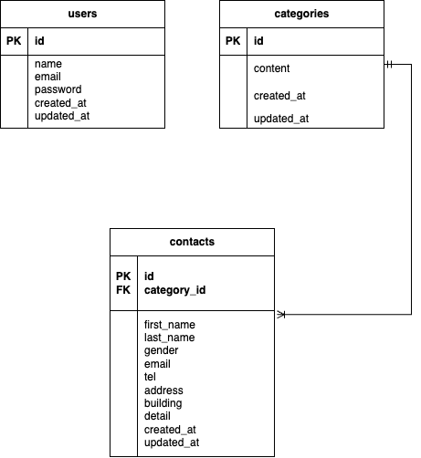

# お問い合わせフォームアプリ

## 環境構築

    Dockerビルド
    1. git clone https://github.com/Mantis4590/test-contact-form.git
    2. docker-compose up -d --build
    * MYSQLは、OSによって起動しない場合があるのでそれぞれのPCに合わせてdocker-compose.ymlファイルを編集してください。

## Laravel環境構築

    1. docker-compose exec php bash
    2. composer install
    3. .env.exampleファイルから.envを作成し、環境変数を変更
    4. php artisan key:generate
    5. php artisan migrate
    6. php artisan db:seed

## 使用技術

・PHP 8.x
・Laravel 8.75
・MySQL 8.0
・Nginx 1.21.1

## ER図

## URL

・開発環境: http://localhost/
・ユーザ登録ページ: http://localhost/register
・ログインページ: http://localhost/login
・phpMyAdmin: http://localhost:8080/